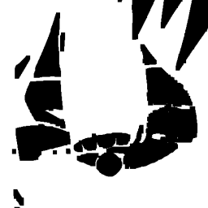
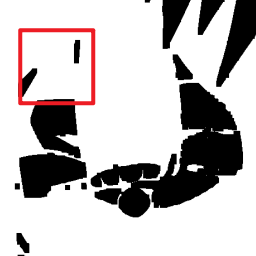

# RM第二次任务
*(没太写过 C++ ，纯GPT选手，就readme是自己写的)*
## 一. 项目概览
项目结构为：
```text
opencv_project/
├── CMakeLists.txt
├── src/
│   └── main.cpp
├── README.md
├── resources/
│   └── test_image.png
├── results/
│   ├── bounding_boxes.png
│   ├── cropped.png
│   ├── ...
└── build/
```
> 注：结果图像均保存在 ```./results/``` 目录下
## 二. 功能说明
**```main.cpp```实现了以下功能：**

### *1. 图像颜色空间转换*
#### 1.1 将图像转化为灰度图
图像保存为 ```gray_image.png```
#### 1.2 将图像转化为HSV图
图像保存为 ```hsv_image.png```


### *2. 对图像进行滤波*
#### 2.1 对图像进行均值滤波
图像保存为 ```mean_blur.png```
#### 2.2 对图像进行高斯滤波
图像保存为 ```hsv_image.png```

### *2. 对图像进行滤波*
#### 2.1 对图像进行均值滤波
图像保存为 ```mean_blur.png```
#### 2.2 对图像进行高斯滤波
图像保存为 ```hsv_image.png```

### *3. 对图像进行特征提取*
#### 3.1 使用HSV方法提取红色区域mask
此处定义红色区域的HSV范围为
```text
[(0, 43, 46)-(10, 255, 255)] v [(156, 43, 46)-(180, 255, 255)]
```
mask保存为 ```red_mask.png```
#### 3.2 在原图上绘制红色区域轮廓
在mask基础上绘制轮廓, 图像保存为 ```red_contours.png```
#### 3.3 计算每个轮廓的面积并输出
各个轮廓面积将在终端输出
#### 3.4 寻找红色区域bbox并绘制
bbox图像保存为 ```bounding_boxes.png```
#### 3.5 提取高亮区域并进行图形学处理
- 3.5.1 使用mask提取原图红色区域，结果保存为 ```HL.png```  
- 3.5.2 对HL进行灰度化，结果保存为 ```HL_gray.png```  
- 3.5.3 对灰度图片进行二值化，结果保存为 ```HL_binary.png```  
- 3.5.4 对二值化后的图像进行膨胀操作，结果保存为 ```HL_dilated.png```  
- 3.5.5 对膨胀后的图像进行腐蚀操作，结果保存为 ```HL_eroded.png```
- 3.5.6 漫水处理。对腐蚀操作后的图像中高亮部分内部一块黑色区域进行漫水处理，处理结果保存为 ```HL_flood_filled.png```  
*漫水操作部分结果示意：*  


### *4.图像绘制*
#### 4.1 绘制圆形，方形和文字
将会在图像左上区域绘制一个圆形和方形，并在图片中部生成 "OpenCV_Project"的文字，图片保存为 ```shapes_text.png```

### *5.对图像进行处理*
#### 5.1 图像旋转35度
结果图像保存为 ```rotated.png```  

#### 5.2 图像裁减为原图左上角1/4
图像保存为 ```cropped.png```